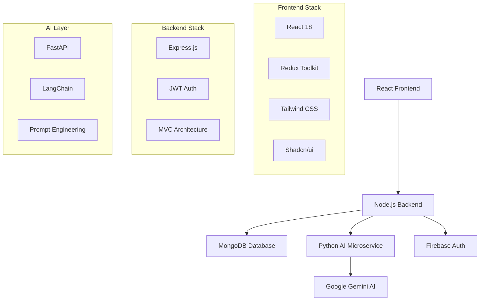

# 🤖 AI TaskFlow - Intelligent Task Management System

<div align="center">


**Transform your goals into actionable tasks with the power of AI**

[](https://ai-taskflow-frontend.onrender.com/)
[](https://opensource.org/licenses/MIT)
[](https://nodejs.org/)
[](https://reactjs.org/)
[](https://python.org/)

</div>

## 🌟 Overview

AI TaskFlow is an intelligent task management web application that revolutionizes how you approach your goals. Simply input your objective and timeline, and watch as our AI breaks it down into structured, actionable weekly and daily tasks. Perfect for students, professionals, and anyone looking to turn ambitious goals into achievable milestones.

### ✨ Key Highlights

- 🧠 **AI-Powered Task Generation** - Intelligent breakdown of goals using Google Gemini AI
- 📊 **Admin Dashboard** - Comprehensive management panel with analytics and user oversight  
- 🔐 **Secure Authentication** - Firebase integration with JWT token management
- 📱 **Responsive Design** - Modern UI that works seamlessly across all devices
- ⚡ **Real-time Updates** - Live task management with Redux state synchronization

## 🚀 Live Demo

**🌐 [Try AI TaskFlow Now](https://ai-taskflow-frontend.onrender.com/)**

*Experience the power of AI-driven task planning firsthand!*

## 🎯 Features

### For Users
- **Smart Goal Planning**: Input any goal with a timeline and get AI-generated task breakdowns
- **Flexible Task Management**: Add, edit, complete, and organize tasks manually
- **Progress Tracking**: Visual progress indicators and completion statistics  
- **Timeline Visualization**: Weekly and daily task organization
- **Secure Account Management**: Personal dashboard with data protection

### For Administrators  
- **User Management**: Comprehensive user oversight and account administration
- **Analytics Dashboard**: System metrics, usage statistics, and performance insights
- **Review System**: Monitor and analyze user feedback and task effectiveness
- **Feedback Management**: Handle user feedback with built-in reply mechanisms
- **Role-based Access**: Advanced permission system (managed via MongoDB)

## 🏗️ System Architecture



### Tech Stack

**Frontend**
- React 18 with Hooks
- Redux Toolkit for state management  
- Tailwind CSS for styling
- Shadcn/ui components
- Responsive design patterns

**Backend**
- Node.js runtime
- Express.js web framework
- MongoDB with Mongoose ODM
- JWT authentication
- RESTful API design

**AI Microservice**
- Python FastAPI framework
- LangChain for AI orchestration
- Google Gemini AI integration
- Custom prompt templates

**DevOps & Deployment**
- Render cloud platform
- Environment-based configuration
- CORS security implementation
- Production-ready builds

## 📋 Prerequisites

Ensure you have the following installed:

- **Node.js** (v14 or higher)
- **Python** (3.8 or higher)  
- **MongoDB** (local or MongoDB Atlas)
- **npm** or **yarn** package manager
- **pip** Python package manager

## 🛠️ Installation & Setup

### 1. Clone the Repository

```bash
git clone https://github.com/Prasadraogorle/Ai-TaskFlow.git
cd Ai-TaskFlow
```

### 2. Frontend Configuration

```bash
cd front-end
npm install
```

Create `.env` file in `front-end` directory:

```env
# Firebase Configuration
VITE_apiKey=your_firebase_api_key
VITE_authDomain=your_firebase_auth_domain
VITE_projectId=your_firebase_project_id
VITE_storageBucket=your_firebase_storage_bucket
VITE_messagingSenderId=your_firebase_messaging_sender_id
VITE_appId=your_firebase_app_id
VITE_measurementId=your_firebase_measurement_id

# Backend Connection
VITE_BACKEND_URL=http://localhost:5000
```

### 3. Backend Configuration

```bash
cd server
npm install
```

Create `.env` file in `server` directory:

```env
# Database
MONGO_URI=your_mongodb_connection_string
PORT=5000

# Firebase Admin SDK
FIREBASE_TYPE=service_account
FIREBASE_PROJECT_ID=your_firebase_project_id
FIREBASE_PRIVATE_KEY_ID=your_firebase_private_key_id
FIREBASE_PRIVATE_KEY=your_firebase_private_key
FIREBASE_CLIENT_EMAIL=your_firebase_client_email
FIREBASE_CLIENT_ID=your_firebase_client_id
FIREBASE_AUTH_URI=https://accounts.google.com/o/oauth2/auth
FIREBASE_TOKEN_URI=https://oauth2.googleapis.com/token
FIREBASE_AUTH_PROVIDER_CERT_URL=https://www.googleapis.com/oauth2/v1/certs
FIREBASE_CLIENT_CERT_URL=your_firebase_client_cert_url
FIREBASE_UNIVERSE_DOMAIN=googleapis.com

# Security
JWT_SECRET_KEY=your_jwt_secret_key

# AI Integration  
GEMINI_API=your_gemini_api_key
MICROSERVICE_URL=http://localhost:8000

# CORS
CLIENT_ORIGIN=http://localhost:3000
```

### 4. AI Microservice Setup

```bash
cd GeminiAiMicroservice
pip install -r requirements.txt
```

Create `.env` file in `GeminiAiMicroservice` directory:

```env
GEMINI_API_KEY=your_gemini_api_key
```

## 🚀 Running the Application

### Development Environment

Start all services in separate terminals:

**1. AI Microservice (Terminal 1):**
```bash
cd GeminiAiMicroservice
python run_server.py
```
*Server starts at: `http://localhost:8000`*

**2. Backend API (Terminal 2):**
```bash
cd server
npm run dev
```
*Server starts at: `http://localhost:5000`*

**3. Frontend Application (Terminal 3):**
```bash
cd front-end
npm run dev
```
*Application starts at: `http://localhost:3000`*

### Production Build

```bash
# Frontend production build
cd front-end
npm run build

# Backend production start
cd server
npm start

# AI Microservice production
cd GeminiAiMicroservice
python run_server.py
```

## 📁 Project Structure

```
ai-taskflow/
├── front-end/                     # React Frontend Application
│   ├── src/
│   │   ├── components/            # Reusable UI components
│   │   ├── pages/                 # Route-based page components
│   │   ├── store/                 # Redux store configuration
│   │   ├── hooks/                 # Custom React hooks
│   │   ├── utils/                 # Helper functions
│   │   └── assets/                # Static assets
│   ├── public/                    # Public assets
│   ├── package.json
│   └── .env
├── server/                        # Node.js Backend Server
│   ├── controllers/               # Request handlers
│   ├── models/                    # Database schemas
│   ├── routes/                    # API route definitions
│   ├── middleware/                # Custom middleware
│   ├── config/                    # Configuration files
│   ├── package.json
│   └── .env
├── GeminiAiMicroservice/          # Python AI Microservice
│   ├── app/                       # FastAPI application
│   ├── models/                    # AI model configurations
│   ├── requirements.txt
│   ├── run_server.py
│   └── .env
├── docs/                          # Documentation
├── README.md
└── LICENSE
```

## 🔧 API Documentation

### User Authentication
```http
POST /api/auth/register          # User registration
POST /api/auth/login             # User login  
POST /api/auth/logout            # User logout
GET  /api/auth/verify            # Verify JWT token
```

### Task Management
```http
GET    /api/tasks                # Get user tasks
POST   /api/tasks                # Create new task
PUT    /api/tasks/:id            # Update task
DELETE /api/tasks/:id            # Delete task
POST   /api/tasks/ai-generate    # Generate AI tasks
```

### Admin Panel
```http
GET    /api/admin/users          # Get all users
GET    /api/admin/dashboard      # Dashboard statistics
GET    /api/admin/reviews        # User reviews
POST   /api/admin/feedback       # Handle feedback
PUT    /api/admin/users/:id      # Update user role
```

### AI Microservice
```http
POST   /generate-tasks           # Generate task breakdown
POST   /analyze-goal             # Analyze goal complexity
```

## 🔐 Admin Panel Setup

To create an admin user, directly update the MongoDB document:

```javascript
// Connect to your MongoDB instance
use ai_taskflow_db

// Update user role to admin
db.users.updateOne(
  { email: "admin@example.com" },
  { $set: { role: "admin" } }
)
```

Admin features include:
- User management and analytics
- System performance monitoring  
- Review and feedback management
- Task generation oversight
- Database administration tools

## 🌐 Deployment Guide

### Render Deployment

The application is deployed on Render with the following configuration:

**Frontend Service:**
```bash
# Build Command
cd front-end && npm install && npm run build

# Start Command  
cd front-end && npm run preview
```

**Backend Service:**
```bash
# Build Command
cd server && npm install

# Start Command
cd server && npm start
```

**AI Microservice:**
```bash
# Build Command  
cd GeminiAiMicroservice && pip install -r requirements.txt

# Start Command
cd GeminiAiMicroservice && python run_server.py
```

### Environment Variables for Production

Ensure all environment variables are configured in your Render dashboard with production values.

## 🧪 Testing

```bash
# Run frontend tests
cd front-end
npm test

# Run backend tests  
cd server
npm test

# Run AI service tests
cd GeminiAiMicroservice  
python -m pytest tests/
```

## 🤝 Contributing

We welcome contributions! Please follow these steps:

1. **Fork the repository**
2. **Create a feature branch** (`git checkout -b feature/AmazingFeature`)
3. **Commit your changes** (`git commit -m 'Add some AmazingFeature'`)
4. **Push to the branch** (`git push origin feature/AmazingFeature`)
5. **Open a Pull Request**

### Development Guidelines

- Follow the existing code style and conventions
- Write clear commit messages
- Add tests for new features
- Update documentation as needed
- Ensure all tests pass before submitting

## 📄 License

This project is licensed under the MIT License - see the [LICENSE](LICENSE) file for details.

## 🙏 Acknowledgments

- **Google Gemini AI** - Powering intelligent task generation
- **Firebase** - Secure authentication infrastructure  
- **MongoDB** - Reliable data storage solution
- **Render** - Seamless deployment platform
- **Open Source Community** - For the amazing tools and libraries

## 🆘 Support & Issues

- 🐛 **Found a bug?** [Open an issue](../../issues)
- 💡 **Have a suggestion?** [Start a discussion](../../discussions)
- 📧 **Need help?** Contact us through the feedback system in the app

## 🔮 Roadmap

- [ ] Mobile application (React Native)
- [ ] Integration with calendar apps
- [ ] Advanced AI analytics and insights
- [ ] Team collaboration features
- [ ] Multi-language support
- [ ] Offline task management
- [ ] Advanced reporting dashboard

## 📊 Project Stats


---

<div align="center">

**Made with ❤️ by [Prasadraogorle](https://github.com/Prasadraogorle)**

*Transforming goals into achievements, one task at a time.*

</div>
